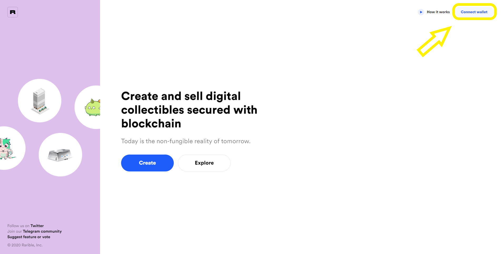
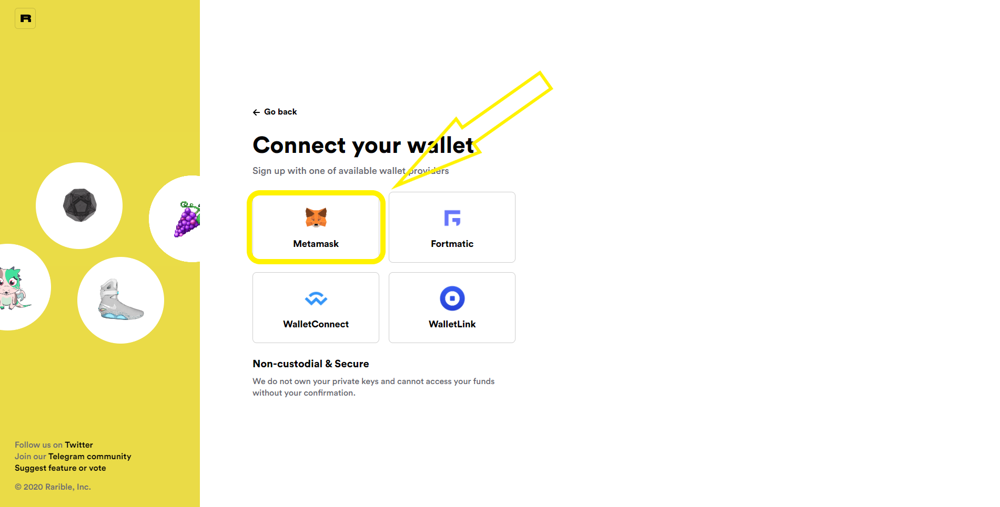
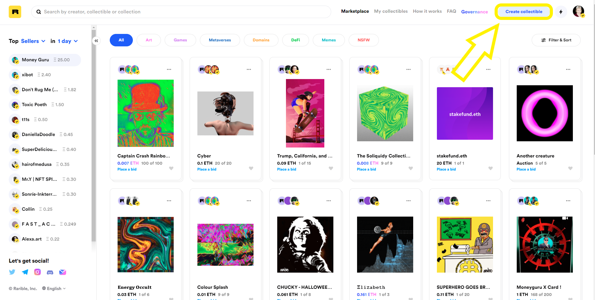
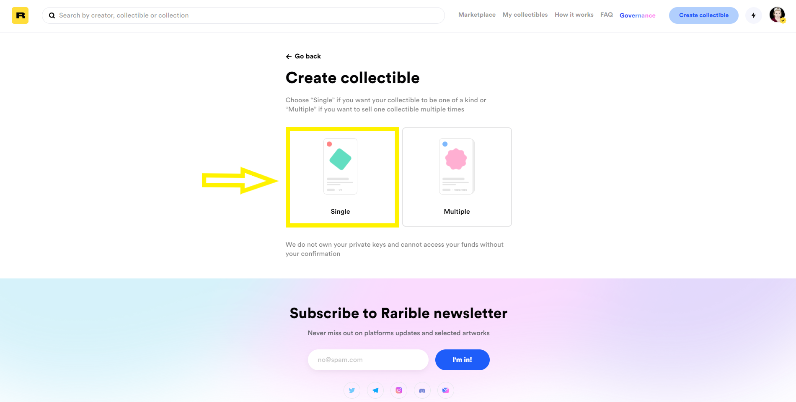
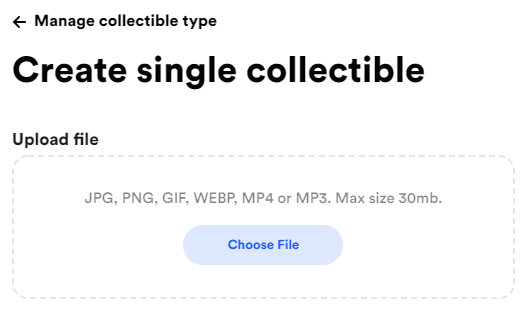

# How to create an NFT \(ERC721\)

### Visting Rarible

To get started head over to [https://rarible.com/](https://rarible.com/) where you will be met with this page  

Now select "Connect Wallet" as marked in the below picture:

Next Select Metamask for the Options of available wallets:

### Creating your NFT

First, select "Create Collectible":

Second, you should select "Single" for an ERC-721:

Third, We need to fill in all the information regarding your NFT, first, we will upload the Image/GIF/MP4 or MP3:

For this example, we'll be using a PNG Image. Next, we'll setup an instant sale price, this will immediately sell the item if the user is willing to pay the price you set. Even with an instant sale price, you will still be able to receive bids on your item. In this case, our instant sale price is 1 Ether \(At the time of writing, the value of 1 Ether is roughly $603.50\).

\(Optional\) If you want to add a link to the Hi-resolution version of your artwork you can do so by adding an unlockable to the creation process.  

Next, we're going to setup the important part of our NFT and that is the NFT Details, 

* Choose Collection: you can create your own or use the default collection which is Rarible, you can think of collections as a folder, you can either create your own folder or use the public folder which in this case is Rarible.
* Name: This is the name of your NFT
* Description: This is the description of your NFT
* Royalties: This is set as a percentage, which you the creator will receive whenever your NFT is sold on the secondary market.
* Properties: You can think of the Properties section as Metadata for your NFT, Key is the title and value is the description, and example would be Key: Artist Name, Value: Rarible.com

Now that all our details are filled in, let's create our NFT! First, we will upload the image like below:  

Next, we will select Mint Token, this is when we create the NFT on the blockchain, When you select Mint Token, Metamask will pop-up and ask you to confirm the transaction like below:  

After selecting Confirm within Metamask, you will be asked to sign the sell order, like below:  

After you've signed the sell order, you'll be taken to your Profile Page where your newly created NFT will appear!  

By clicking on your NFT, you'll be able to see the information you provided, like below you can see the Name, Description, Current Owner, The Creator as well as the collection:  

By Visting the details tab on the right-hand side we're able to see the NFT "Metadata" we added:  

Now all that's left to do is to wait for a bid or a buyer, **Congrats on Publishing your very first NFT!!**

